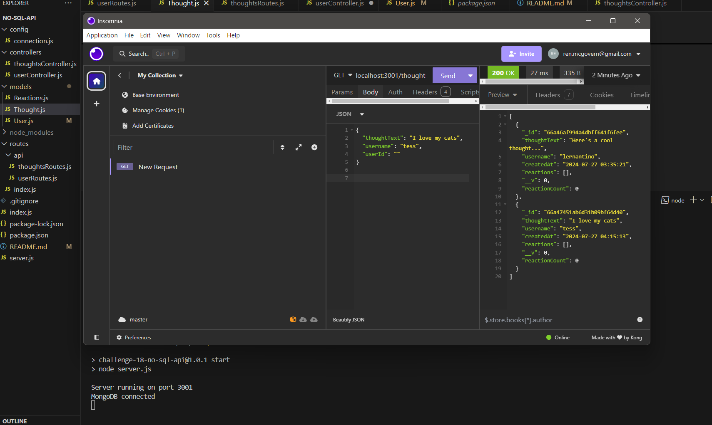

# Social Network API

## Description
> NO SQL Challenge:  
> Using **Express.js**, **MongoDB**, and **Mongoose ODM**, build a social network web app where users can share their thoughts, react to friends' thoughts, and create a friend list.

## Table of Contents
I. [Acceptance Criteria](#acceptance-criteria)  
II. [Example Image of App](#image-example-of-working-app)  
III [Video Walk-through](#video-tutorial)  

## Acceptance Criteria
> - GIVEN a social network API
> - When I enter the command to invoke the application
>   - My server is started and the Mongoose models are synced to the MongoDB database
> - When I open API GET routes in Insomnia for users and thoughts
>   - The data for each of these routes is displayed in a formatted JSON
> - When I test API POST, PUT, and DELETE routes in Insomnia
>   - I am able to successfully create, update, and delete users and thoughts in my database
> - When I test API POST and DELETE routes in Insomnia
>   - I am able to successfully create and delete reactions to thoughts and add and remove friends to a user’s friend list

# Image Example of Working APP

# Video Tutorial